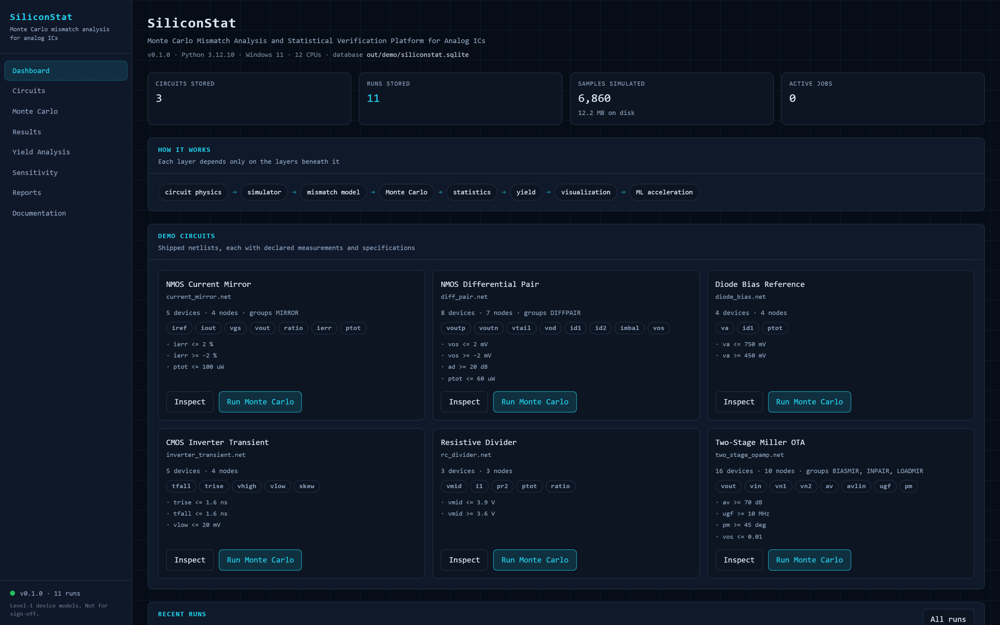
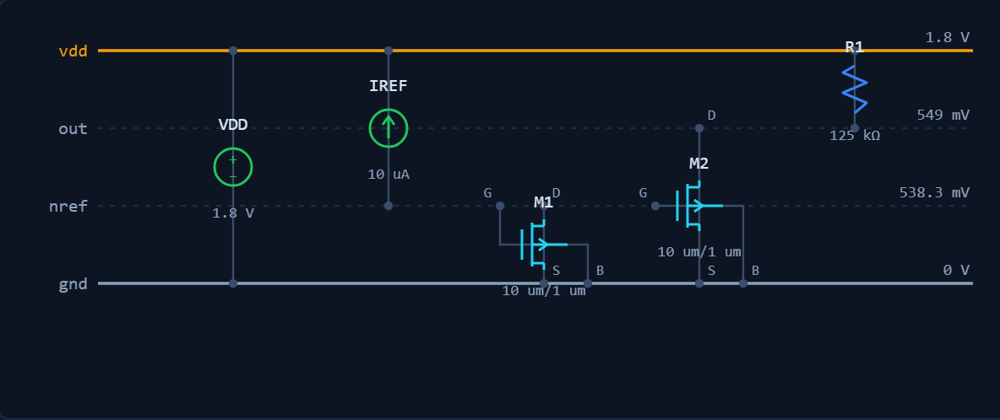
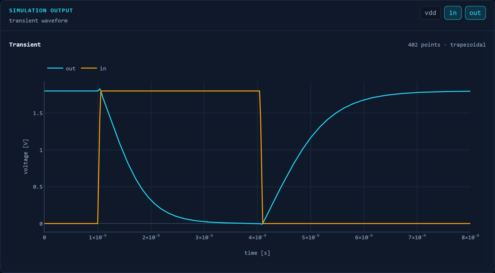
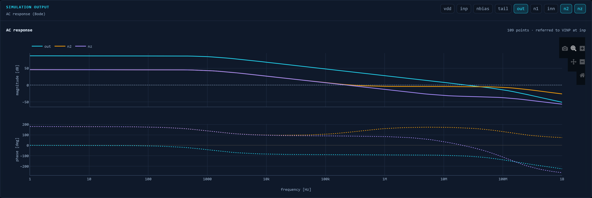
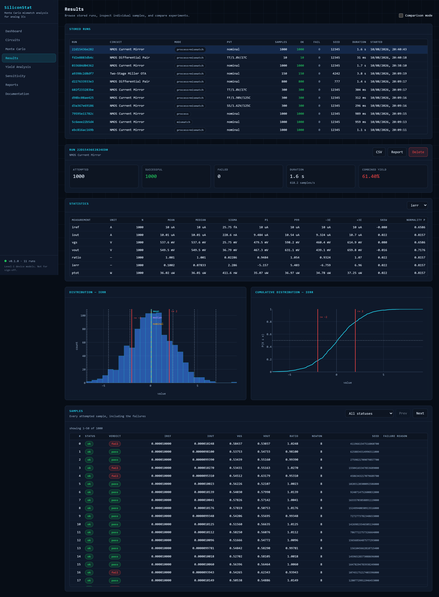
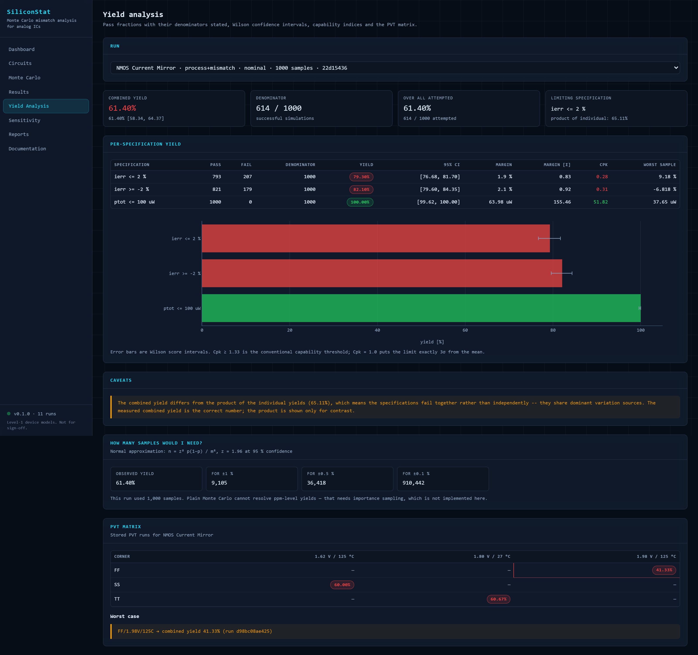
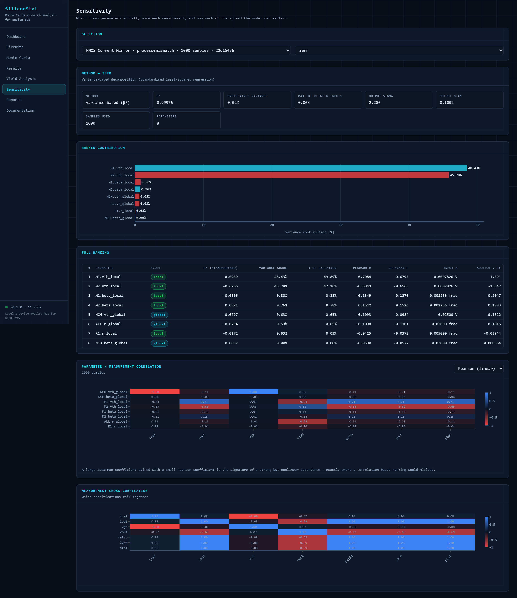
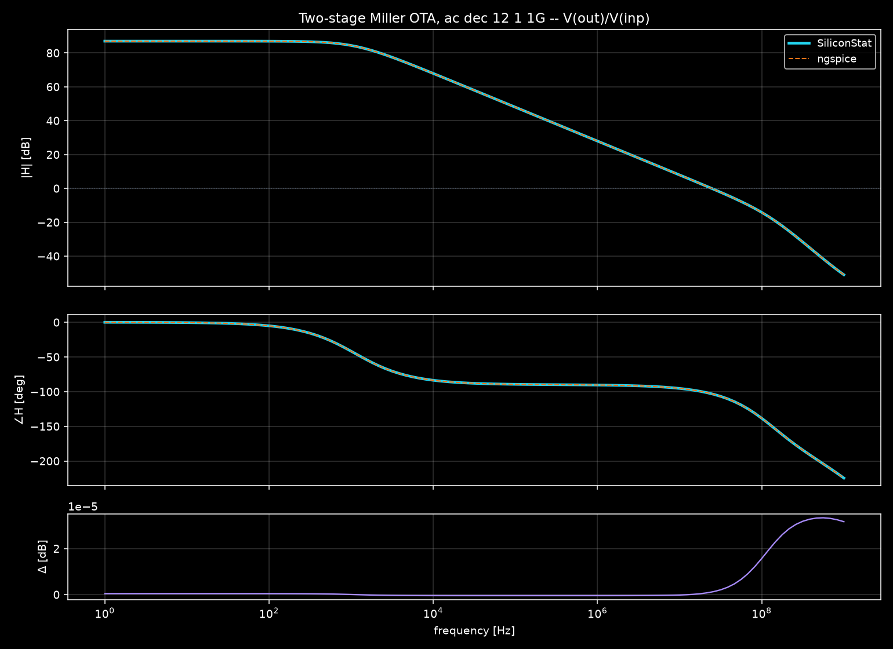
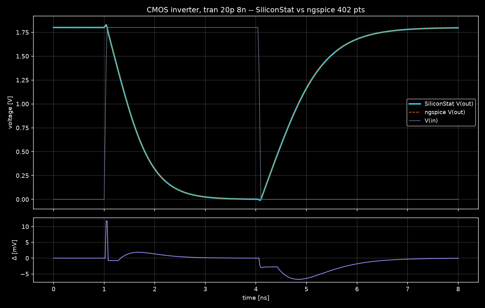

# SiliconStat

**Monte Carlo Mismatch Analysis and Statistical Verification Platform for
Analog ICs**

[](https://github.com/ADuetrohit/siliconstat/actions/workflows/ci.yml)
[](https://www.python.org/downloads/)
[](LICENSE)

A software-only EDA application that simulates transistor-level analog
circuits, injects physically meaningful process variation and local device
mismatch, repeatedly re-simulates randomised circuit instances, analyses the
results statistically, computes yield, identifies the dominant mismatch
sources, and presents all of it through a CLI, a REST API and a dark
engineering dashboard.

The circuit simulator is written from scratch — Modified Nodal Analysis, a
Newton-Raphson solver with continuation strategies, DC/AC/transient — because
the statistics only mean something if the physics underneath is real.



```
781 tests, 780 passed, 1 skipped, 40.3 s
```

## Why it exists

Every analog block is built from devices that are supposed to be identical and
never are.  A current mirror copies a current only as well as its two
transistors match; a comparator's offset *is* the mismatch of its input pair.
The question "will this work across a wafer?" is a statistical one, and
answering it requires four things at once: a simulator that solves the real
nonlinear circuit, a variation model that is physically grounded rather than
hand-waved, a Monte Carlo engine that is reproducible and honest about
failures, and statistics that state their own uncertainty.

SiliconStat is an attempt to build all four properly and to be candid about
where each one stops.

## The layer hierarchy

Each layer depends only on those beneath it.

```
  circuit physics  →  simulator  →  measurements  →  mismatch model
                   →  Monte Carlo →  statistics    →  yield
                   →  visualization →  ML acceleration
```

```
 9  ML acceleration     siliconstat/ml          surrogate trained on real runs
 8  visualization       siliconstat/report      inline-SVG report, REST, React
                        siliconstat/api
 7  yield               siliconstat/analysis    Wilson intervals, Cp/Cpk
 6  statistics          siliconstat/analysis    Welford, correlation, sensitivity
 5  Monte Carlo         siliconstat/mc          seeding, failure accounting
 4  mismatch model      siliconstat/variation   global/local, Pelgrom, PVT
 3  measurements        siliconstat/measure     v/i/p, gain, BW, PM, offset
 2  simulator           siliconstat/core        MNA, Newton-Raphson, AC, tran
 1  circuit physics     siliconstat/core        level-1 MOSFET, diode, passives
```

ML sits at the *top*: it is an optimisation over a pipeline that already works,
trained on that pipeline's own output — never a substitute for a layer below.

## Features

**Simulator** — MNA with dense LU; Newton-Raphson with exact analytic
Jacobians; dual voltage/current convergence test; four continuation strategies
(direct, damped, gmin stepping, source stepping); DC operating point, AC
small-signal, fixed-step trapezoidal transient; resistors, capacitors,
inductors, independent V/I sources, diodes, NMOS/PMOS.

**Device physics** — square-law MOSFET with three regions, channel-length
modulation, body effect, analytic `gm`/`gds`/`gmb`, reverse-mode drain/source
swap, first-order temperature dependence, region-dependent Meyer capacitances.

**Netlist** — SPICE-like syntax with `.model`, `.param` with safe arithmetic
expressions, `.option`, `.temp`, `.include`, `.op`/`.ac`/`.tran`, `.measure`
and `.spec`.  Errors carry the line number and the offending text.

**Measurements** — node voltage, branch current, power, safe expressions,
AC gain, −3 dB bandwidth, unity-gain frequency, phase margin, gain margin,
input-referred offset (from two real DC solves), rise/fall/settling/overshoot
and transient statistics.

**Variation** — global (process) and local (mismatch) scopes; matched groups;
Gaussian, uniform and log-normal marginals through a Gaussian copula;
correlated variables via Cholesky with full matrix validation; Pelgrom area
scaling; PVT corners crossed with mismatch.

**Monte Carlo** — per-sample seeding that makes parallel and sequential runs
bit-identical; standard and Latin hypercube sampling; a seven-way failure
taxonomy where nothing is discarded; process-pool parallelism with automatic
sequential fallback.

**Analysis** — Welford statistics with percentiles and confidence intervals;
Pearson and Spearman correlation; variance-based sensitivity with an honest
`R²`; yield with both denominators, Wilson intervals and Cp/Cpk; convergence
traces.

**Interfaces** — a full CLI, a FastAPI REST service with background jobs, a
React dashboard, a standalone HTML report with inline SVG charts, and CSV /
JSON / Parquet export.

## Installation

```bash
git clone https://github.com/ADuetrohit/siliconstat.git
cd siliconstat
python -m venv .venv                      # Python 3.10+; 3.12 recommended
.venv/Scripts/activate                    # Windows
# source .venv/bin/activate               # Linux / macOS
pip install -e ".[all]"
```

Or with Docker, which builds the frontend and serves everything on one origin:

```bash
docker compose up --build                 # http://localhost:8000
```

## Quick start

```bash
$ siliconstat circuit validate examples/current_mirror.net
  DC operating point converged (8 Newton iterations, strategy 'direct',
  KCL residual 3.39e-21 A)
  netlist is valid

$ siliconstat simulate examples/current_mirror.net
  node    voltage
  vdd       1.8 V
  nref  538.3 mV
  out   549.0 mV

  device  model  region         Id     Vgs     Vds        gm  gm/Id
  M1      NCH    saturation  10 uA  0.5383  0.5383  226.5 uS  22.65
  M2      NCH    saturation  10 uA  0.5383  0.5490  226.7 uS  22.65

  measurement        value  unit  status
  iref               1e-05  A     ok
  iout         1.00082e-05  A     ok
  ierr           0.0819827        ok

$ siliconstat monte-carlo --circuit examples/current_mirror.net \
      --samples 1000 --seed 12345 --mode mismatch
```

## The three demo circuits

Measured results, reproducible with `docs/scripts/collect_doc_numbers.py`.

### 1. NMOS current mirror — `examples/current_mirror.net`

Two 10 µm × 1 µm devices at 10 µA.  Nominal copy error 0.082 %, entirely
channel-length modulation.  With mismatch (2000 samples):

```
sigma(ierr)   = 2.350 %          first-order theory predicts 2.306 %
combined yield  60.20 %  [58.04, 62.32]   for |ierr| <= 2 %
sensitivity     M1.vth_local 46.6 %,  M2.vth_local 46.6 %,  R^2 = 0.9997
```

93 % of the variance is the two local thresholds, in exact opposition.  Global
variation contributes 0.6 %, because it cancels in the ratio.

### 2. NMOS differential pair — `examples/diff_pair.net`

The headline demonstration: **input-referred offset**, measured from two real
DC solves rather than modelled.  Matched devices give `Vos = −1e-16 V`.  With
mismatch (2000 samples):

```
sigma(Vos)  = 824.3 uV           theory: sqrt(dVth^2 + (Vov/2 * dbeta/beta)^2
                                              + (Vov/2 * dR/R)^2) = 815.1 uV
Ad          = 23.92 dB           gm*(RL || ro) predicts 15.70 V/V
```

### 3. Two-stage Miller OTA — `examples/two_stage_opamp.net`

DC-closed / AC-open testbench, so the output parks at the input common mode
instead of a rail once mismatch is injected.

```
Av = 86.94 dB    UGF = 24.50 MHz    PM = 76.9 deg    BW = 1119 Hz
P  = 145.1 uW    Vos = 37.3 uV (systematic)
GBW = gm1/(2*pi*Cc) predicts 25.6 MHz;   Av*BW = 24.9 MHz vs UGF 24.50 MHz
```

Three more circuits ship for validation and coverage: a resistive divider
(exact closed form), a diode bias reference (transcendental), and a CMOS
inverter with transient edge measurements.

## Running the application

**Backend**

```bash
siliconstat serve                         # http://127.0.0.1:8000, API docs at /api/docs
```

**Frontend**

```bash
cd frontend
npm install
npm run dev                               # http://localhost:5173, proxies /api
npm run build                             # emits frontend/dist
```

When `frontend/dist` exists the API serves it at `/`, so a production
deployment is a single process on a single port.

## The dashboard

Eight pages, all of them driven by real computation — there is no seeded data
and no mock API anywhere in the frontend.

**Circuits** parses a netlist, draws it as a node-rail schematic annotated with
the solved operating point, and plots whatever the netlist's own `.tran` or
`.ac` card asks for.

| | |
| --- | --- |
|  | Layout comes from the topology: supplies on top, ground at the bottom, each device in its own column with its solved node voltages on the right. |



The CMOS inverter above is `.tran 20p 8n`. The spike where the output crosses
above the 1.8 V rail at the input edge is gate-drain capacitive coupling, and
the pull-up being visibly slower than the pull-down is the βn/βp asymmetry —
both fall out of the solve rather than being drawn in.



**Results** shows the distribution, the CDF, per-measurement statistics, and
every attempted sample — including the failures, with the seed that produced
each one so any of them can be re-simulated in isolation.



**Yield analysis** states its denominator, which is the whole point. Wilson
score intervals rather than the normal approximation, Cpk per specification,
and an explicit note when the combined yield differs from the product of the
individual yields — that gap means the specifications fail *together*.



**Sensitivity** decomposes the variance of a measurement across the drawn
parameters, and reports `R²` so you can see how much it failed to explain.



For the current mirror's copy error this recovers the textbook answer without
being told it: the two local thresholds contribute 48.4 % and 45.8 % with
opposite signs, while global threshold variation contributes 0.63 % because it
cancels in a ratio.

## Testing

```bash
pytest -q                    # 781 tests, 40 s
pytest -q -m "not slow"      # the fast subset, ~25 s
pytest -q -m ngspice         # the cross-validation only (needs ngspice)
```

The suite is organised by layer.  `tests/test_analytical.py` is the important
one: it checks the simulator against closed-form answers — Ohm's law, the
Shockley equation, the square law, `gm = 2Id/Vov`, `GBW = gm1/2πCc`,
`trise/tfall = βn/βp` — rather than against its own previous output.  See
[docs/validation.md](docs/validation.md).

## Example CLI commands

```bash
siliconstat circuit validate examples/diff_pair.net
siliconstat simulate examples/two_stage_opamp.net --json out/op.json
siliconstat simulate examples/current_mirror.net --corner SS --supply 1.62 --temp 125

siliconstat monte-carlo --circuit examples/diff_pair.net \
    --samples 1000 --seed 12345 --mode mismatch --out out/diffpair

siliconstat pvt --circuit examples/current_mirror.net --samples 150 \
    --metric ierr --corners TT FF SS --temps -40 27 125

siliconstat runs list
siliconstat runs compare <run-a> <run-b>
siliconstat report --run <run-id> --out report.html
siliconstat ml    --circuit examples/current_mirror.net --train 500 --test 300
siliconstat bench --circuit examples/current_mirror.net --samples-list 100 1000
siliconstat serve --port 8000
```

## Technical highlights

Things here that are not obvious and were worth getting right:

- **The Newton residual is free and exact.**  Because each device stamps a
  companion model that is exact at the linearisation point, `G(x)·x − b(x)` *is*
  the nonlinear KCL residual — no second evaluation pass is needed to test
  convergence in the current domain.
- **Tolerances are tighter than SPICE's, deliberately.**  `reltol=1e-3` would
  sit on top of the 0.08 % effects this tool measures, so the default is
  `1e-6`.  Cost: about one extra Newton iteration.
- **Per-sample seeding.**  Sample *i* draws from
  `SeedSequence(seed, spawn_key=(i,))`, so parallel and sequential runs are
  bit-identical and any single sample can be re-simulated in isolation.
  Verified through the API: 560 values compared, 0 mismatches.
- **The Pelgrom √2.**  `AVT` is quoted for a *pair*, so the per-device sigma is
  `AVT/√(2WL)`.  Getting this wrong scales every reported sigma by 1.41.
- **Frozen Meyer capacitances.**  Recomputing region-dependent capacitances
  inside the Newton loop makes the Jacobian discontinuous at region boundaries;
  the inverter transient failed at the input edge until they were held constant
  per timestep.  7× faster afterwards.
- **Bandwidth is refined, not interpolated.**  Grid interpolation at 30
  points/decade is 0.24 % off; bisection on the real transfer function gets to
  3.7e-7.  And "−3 dB" means the half-power point, `10·log10(2)`.
- **Wilson intervals, not the normal approximation**, which would claim a 50/50
  run proves 100 % yield.
- **Variance-based sensitivity that refuses to lie.**  With more parameters
  than samples, least squares returns a meaningless `R² = 1.0`; the analysis
  detects that, falls back to correlation ranking, and says why.
- **An ML surrogate that reports its break-even point** rather than a raw
  per-prediction speedup, because training costs a full Monte Carlo run.
- **No `eval`.**  Netlist expressions are walked as an AST against a whitelist,
  because netlists arrive over HTTP.
- **Cross-validated against ngspice 46**, by *converting* the shipped netlists
  rather than maintaining a second set of decks — so a disagreement can never
  be dismissed as "the two netlists differed".  It found a real bug; see below.

## Project layout

```
src/siliconstat/
  core/          units, expr, models, mosfet, devices, mna, circuit,
                 netlist, solver, context, waveforms, exceptions
  measure/       measurement extraction
  variation/     distributions, correlation, pelgrom, spec, sampler, pvt
  mc/            config, engine, results
  analysis/      statistics, yield, correlation, sensitivity, convergence
  db/            schema, store
  report/        charts (inline SVG), html_report, export
  ml/            surrogate
  api/           schemas, jobs, service, main
  cli/           main, format
examples/        six demo netlists
frontend/        React + TypeScript + Vite + Tailwind + Plotly
tests/           781 tests
docs/            architecture, circuit_solver, mosfet_model, monte_carlo,
                 mismatch, pelgrom, statistics, yield, validation, limitations
scripts/         benchmark runner
```

## What cross-validation found

Running the shipped circuits through ngspice 46 caught a defect that
SiliconStat could not have caught alone.

Four circuits agreed to 1e-7 immediately.  The two-stage op-amp disagreed by up
to 194 % — and it was the only circuit containing PMOS devices.  The cause: a
PMOS `VTO` is negative by SPICE convention, but the shipped cards wrote
`VTO=0.45`.  SiliconStat normalises with `abs()` and read an enhancement
device; ngspice took the sign literally and built a *depletion* device that
conducts at `Vgs = 0`.  The two tools were simulating different circuits.

Neither was arithmetically wrong — the netlist was ambiguous, and only a second
implementation could expose it.  The cards now use the portable form, a test
enforces it, and `docs/validation.md` records the whole episode.

That is the argument for cross-validation in one paragraph.

### Where the two tools now stand

Comparison is whole-trace, not just the operating point.
`docs/scripts/ngspice_waveforms.py` converts the shipped netlists, runs the
identical analysis card in ngspice, and resamples its vectors onto
SiliconStat's grid; `tests/test_ngspice.py` asserts the result.

**AC** — the OTA's full Bode response over 109 points. Nothing is integrated
here, so this is the conditioning floor:

| | max difference | rms |
| --- | --- | --- |
| V(out)/V(inp) magnitude | 3.3e-05 dB | 1.0e-05 dB |
| V(out)/V(inp) phase | 1.3e-04 deg | 3.9e-05 deg |

DC gain 86.9434 dB and unity-gain frequency 24.4915 MHz — identical in both
tools to every digit printed.



**Transient** — here they legitimately differ, and the test asserts a bounded
difference rather than equality. SiliconStat integrates on a fixed 20 ps grid;
ngspice picks its own timestep from a truncation-error estimate and returned
421 points to our 402. Worst disagreement on V(out) is 11.8 mV — 0.64 % of the
swing — and it lands at t = 1.04 ns, the falling edge, where a fixed grid pays
most for its rigidity. The stimulus and supply, which are algebraic rather than
integrated, match to 9e-12 V and exactly zero.



`docs/scripts/ngspice_plots.py` also drives ngspice's own `hardcopy` renderer,
so the comparison can be made against ngspice's plots rather than against a
re-plot of its data.

## Limitations

Read [docs/limitations.md](docs/limitations.md) before believing any absolute
number.  The short version:

- The MOSFET model is square-law level-1: no velocity saturation, no DIBL, no
  subthreshold conduction.  **Not BSIM, not silicon-calibrated, not for
  sign-off.**
- The shipped model cards are plausible 180 nm-class numbers, not a PDK.
- Transient is fixed-step with no error control; the matrix solver is dense.
- Plain Monte Carlo cannot resolve ppm yields; no importance sampling is
  implemented.
- No noise, no aging, no layout-dependent effects, no subcircuits.
- No authentication on the API; single-node SQLite; in-process job queue.
- Cross-validation against ngspice covers DC, AC and transient, but only
  against ngspice's own level-1 model — it proves the two implementations
  agree, not that either matches silicon.  The statistical layers have no
  second implementation to check against and are validated against closed
  forms instead.

## Future work

Sparse matrices and hierarchical `.subckt` for larger designs; adaptive
timestep with LTE control; a charge-based capacitance model; importance
sampling and worst-case-distance for high-sigma yield; a noise analysis;
proximity-dependent mismatch once layout coordinates exist; a PostgreSQL
backend and a durable job queue.

## License

[MIT](LICENSE).
